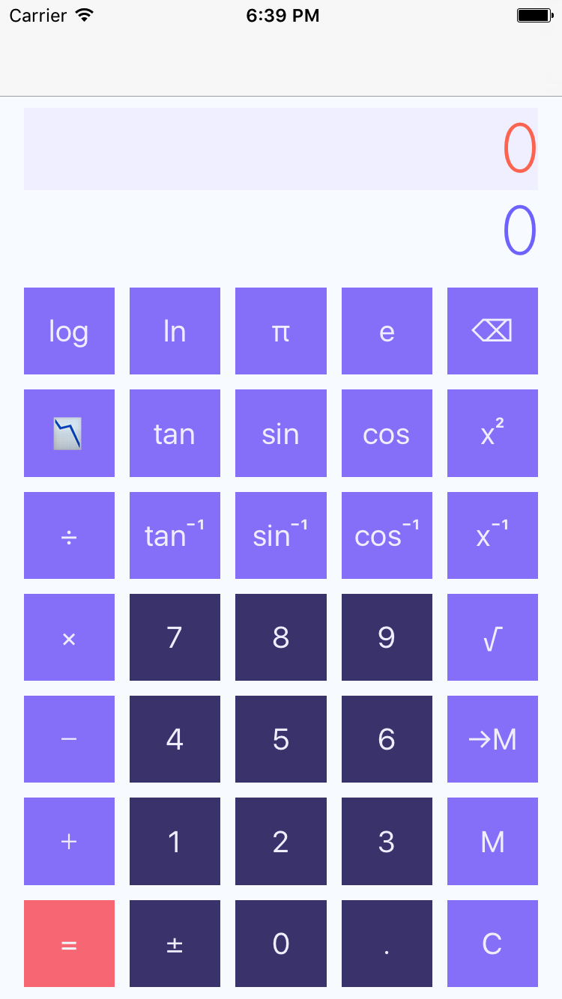
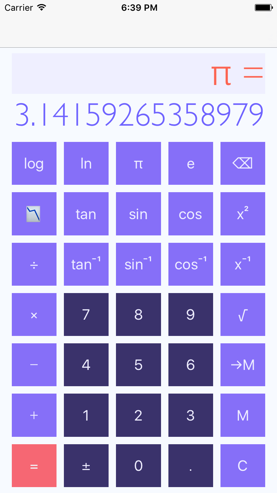
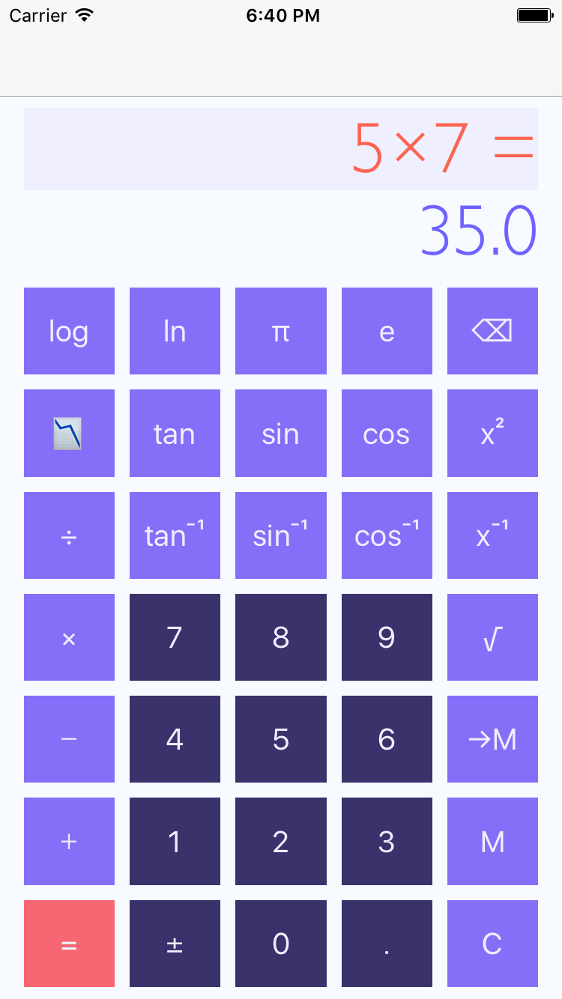
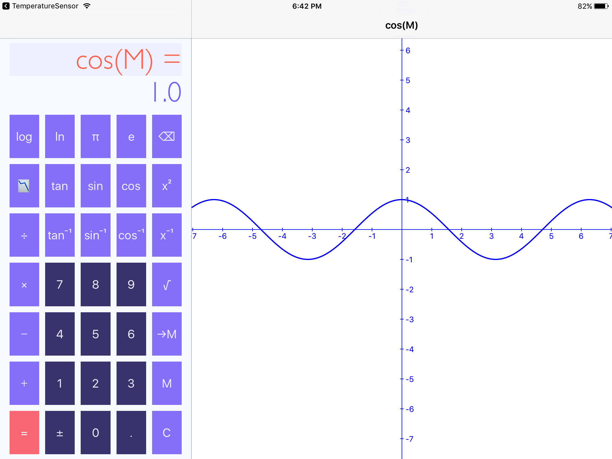
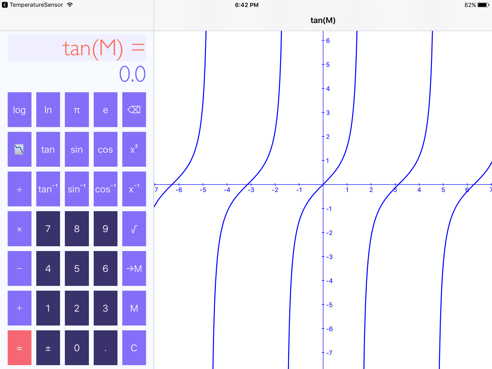

# Graphing-Calculator

Graphing calculator can graph given function on the detail view controller of split view controller.

1. Implements UISplitViewController
2. Can save results to its member for later use
3. Implements MVC framework
4. Upon device rotation, the graph is centered and adjusted slightly with the width and height change ratio

Screenshots
-----------

  
 
